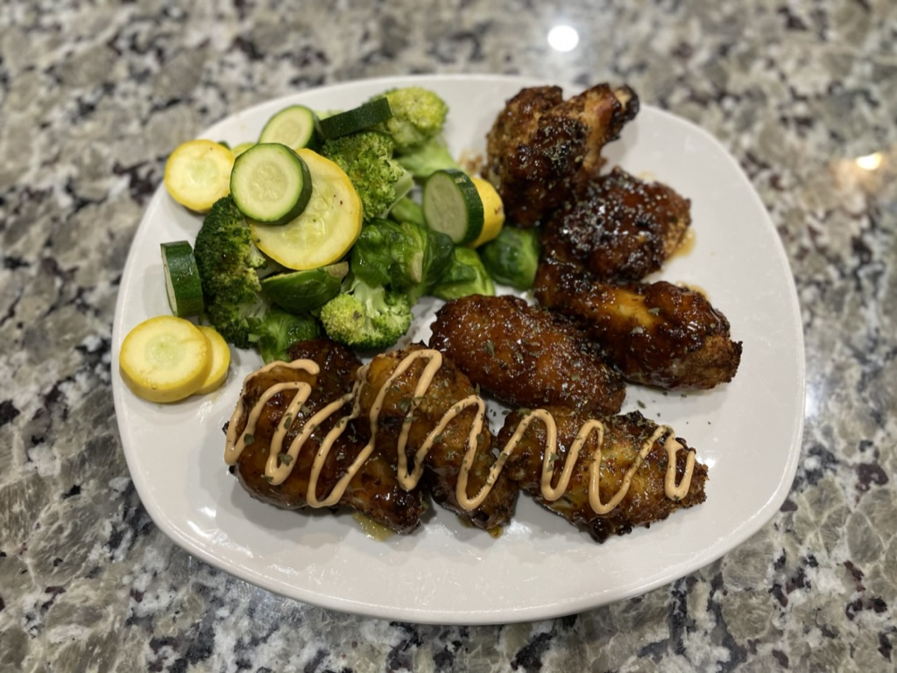

<!-- PROJECT LOGO -->
<br />
<div align="center">
  <a href="https://github.com/bkeener7/lunch_and_learn">
    
  </a>

  <h1 align="center">Lunch and Learn Backend Application</h3>

  <h3 align="center">
    Find and save recipes by country!
    <br />
  </h3>
</div>

<!-- TABLE OF CONTENTS -->
<h3>
  <details>
    <summary>Table of Contents</summary>
    <ol>
      <li>
        <a href="#about-the-project">About The Project</a>
        <ul>
          <li><a href="#built-with">Built With</a></li>
          <li><a href="#database-schema">Database Schema</a></li>
        </ul>
      </li>
      <li>
        <a href="#getting-started">Getting Started</a>
        <ul>
            <li><a href="#repository">Repository</a></li>
            <li><a href="#back-end-repository-installation">Back-End Repository Installation</a></li>
            <li><a href="#endpoints">Endpoints</a></li>
        </ul>
      </li>
      <li><a href="#contact">Contact</a></li>
      <li><a href="#acknowledgments">Acknowledgments</li>
      <li><a href="#license">License</a></li></a>
    </ol>
  </details>
</h3>

<!-- ABOUT THE PROJECT -->
## About The Project

Lunch and Learn is an application to search for cuisines by country, and provide opportunity to learn more about that countries culture. This app is the backend component that will allow users to search for recipes by country, favorite recipes, and learn more about a particular country.

<p align="right">(<a href="#top">back to top</a>)</p>

<!-- Built With -->
### Built With


### Gems

- [Capybara](https://github.com/teamcapybara/capybara)
- [Factory Bot Rails](https://github.com/thoughtbot/factory_bot_rails)
- [Faker](https://github.com/vajradog/faker-rails)
- [Faraday](https://lostisland.github.io/faraday/usage/)
- [Figaro](https://github.com/laserlemon/figaro)
- [JSON:API Serializer](https://github.com/jsonapi-serializer/jsonapi-serializer)
- [Pry](https://github.com/pry/pry)
- [RSpec-rails](https://github.com/rspec/rspec-rails)
- [RuboCop Rails](https://github.com/rubocop/rubocop-rails)
- [SimpleCov](https://github.com/simplecov-ruby/simplecov)
- [Shoulda-Matchers](https://github.com/thoughtbot/shoulda-matchers)
- [Webmock](https://github.com/bblimke/webmock)
- [VCR](https://github.com/vcr/vcr)

<p align="right">(<a href="#top">back to top</a>)</p>

<!-- Database Schema -->
### Database Schema

The Lunch and Learn application utilizes a one-to-many relationship to organize the user's favorite recipes. 


<p align="right">(<a href="#top">back to top</a>)</p>

<!-- GETTING STARTED -->
## Getting Started

To get started, follow the instructions below, and have fun!

<!-- Repositories -->
### Repository

<a href="https://github.com/bkeener7/lunch_and_learn">Lunch and Learn Repository</a>

<p align="right">(<a href="#top">back to top</a>)</p>

<!-- Back-End Repository Installation -->
### Back-End Repository Installation
1. Fork (optional) and clone to your local machine.

2. Gem Installation
* `bundle install`
* `bundle exec figaro install`

3. Required API keys: 
* <a href="https://developer.edamam.com/edamam-recipe-api">Edamam API and App Key</a>
* <a href="https://developers.google.com/youtube/v3">YouTube API Key</a>
* <a href="https://unsplash.com/developers">Unsplash Access Key</a>

4. Once gathered, setup your environmental variables in `config/application.yml` as below:

```yml
    edamam_app_id: <YOUR APP ID>
    edamam_app_key: <YOUR API KEY>
    google_API_KEY: <YOUR API KEY>
    unsplash_access_key: <YOUR ACCESS KEY>
```

5. Database Setup 

* `rails db:{drop,create,migrate,seed}`

<p align="right">(<a href="#top">back to top</a>)</p>

<!-- Endpoints -->
### Endpoints

#### GET
* `/api/v1/recipes`
* `/api/v1/learning_resources`
* `/api/v1/favorites`
#### POST
* `/api/v1/users`
* `/api/v1/favorites`

<p align="right">(<a href="#top">back to top</a>)</p>

<!-- CONTACT -->
## Contact

<table>
  <tr>
    <td></td>
  </tr>
  <tr>    
    <td>Bryan Keener</td>
  </tr>
  <tr>
    <td>
      <a href="https://github.com/bkeener7">GitHub</a><br>
      <a href="https://www.linkedin.com/in/bkeener/">LinkedIn</a>
    </td>
  </tr>
</table>

<p align="right">(<a href="#top">back to top</a>)</p>

<!-- ACKNOWLEDGMENTS -->
## Acknowledgments

Turing School of Software Design: [https://turing.edu/](https://turing.edu/)

<p align="right">(<a href="#top">back to top</a>)</p>

<!-- LICENSE -->
## License

Distributed under the MIT License.

<p align="right">(<a href="#top">back to top</a>)</p>